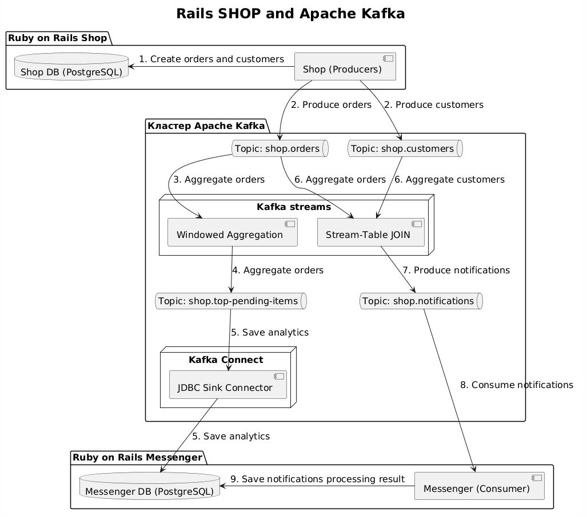

# 🛒 Итоговый проект по курсу «Apache Kafka для разработчиков»

## 📝 Описание проекта
Данный проект представляет собой полноценный демонстрационный сервис, имитирующий работу интернет-магазина с аналитикой в реальном времени и системой уведомлений. Проект задействует ключевые технологии экосистемы Apache Kafka для обеспечения отказоустойчивости и высокой скорости обработки данных.

### ⚙️ Стек технологий и требования
Проект успешно реализует следующие обязательные компоненты:
* **Инфраструктура:** Кластер Apache Kafka
* **Управление и мониторинг:** AKHQ (порт `8086`)
* **Потоковая обработка:** Kafka Streams (агрегация топ-товаров)
* **Интеграция данных:** Kafka Connect & реляционная СУБД (SQL)
* **Разработка:** Продюсеры и консьюмеры на Java / СУБД

---

## 📐 Архитектура проекта

Взаимодействие компонентов системы и движение данных отображены на схеме ниже:



---

## 🚀 Быстрый запуск

### 1. Подготовка окружения
Инициализируйте переменные окружения, скопировав шаблон `.env`:
```bash
make copy-env
```

### 2. Запуск контейнеров
Запустите Docker-контейнеры проекта:
```bash
make up
```
> ⚠️ **Важно:** Инициализация всех контейнеров и Kafka Connect может занять некоторое время. Если инит-скрипты не успели отработать корректно с первого раза, просто перезапустите команду: `make up`.

---

## 🌐 Доступные интерфейсы и API

После успешного запуска проект распределяется по следующим локальным адресам:

| Компонент | URL / Эндпоинт | Описание |
| :--- | :--- | :--- |
| **Магазин (Web)** | `http://localhost:3000` | Основной сервис магазина |
| **Админка / Мессенджер** | `http://localhost:3001` | Панель мониторинга и уведомлений |
| **AKHQ** | `http://localhost:8086` | Интерфейс управления кластером Kafka |

### 🛠️ Тестирование сценариев (Эндпоинты)
* **Создание пользователей:** [http://localhost:3000/users](http://localhost:3000/users)
* **Создание заказов:** [http://localhost:3000/orders](http://localhost:3000/orders)

### 📊 Просмотр результатов в админке
* **Топ популярных товаров:** [http://localhost:3001/top_pending_items](http://localhost:3001/top_pending_items)
* **Лента уведомлений:** [http://localhost:3001/notifications](http://localhost:3001/notifications)

---

## ⚙️ Настройка Kafka Streams (Аналитика)

В текущей конфигурации окно агрегации настроено на **1 минуту**, а система высчитывает **3 наиболее популярных товара**.

Если вы хотите изменить логику окна или количество выводимых позиций, отредактируйте константы `ITEMS_COUNT` и `WINDOW_SIZE` в файле:
📂 `streams/src/main/java/shop/streams/TopPendingItemsStream.java`
